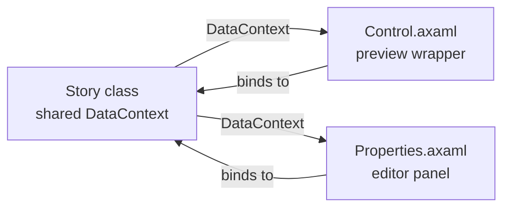

# IStory Interface

The `IStory<TControl, TStoryProperties>` interface is the core contract for defining a story in Awen.

## Definition

```csharp
public interface IStory<out TControl, out TStoryProperties>
    where TControl : Control
    where TStoryProperties : Control
{
    string Name { get; }
    string Group { get; }
    int Order { get; }
    string Description { get; }
    TControl CreateControl();
    TStoryProperties CreateProperties();
}
```

## Properties

### Name

The display name for this story variant (e.g., `"Default"`, `"Disabled"`, `"Large"`). Shown in the sidebar as a leaf node.

### Group

A hierarchical path using `/` as separator (e.g., `"Atoms/Buttons"`, `"Molecules/Feedback"`). Determines the sidebar tree structure. Stories with the same group are grouped together.

### Order

Sort order among sibling stories in the same group. Lower values appear first. Use this to control the ordering of story variants.

### Description

A human-readable description displayed below the preview canvas. Describes what the story demonstrates.

## Methods

### CreateControl()

Returns a fresh `UserControl` instance that wraps the actual control being previewed. Awen sets the returned control's `DataContext` to the story instance, so XAML bindings connect directly to the story's public properties.

### CreateProperties()

Returns a `UserControl` that provides interactive editors for the story's state. Like `CreateControl()`, its `DataContext` is set to the story instance. Use standard Avalonia controls — `TextBox`, `ToggleSwitch`, `NumericUpDown`, `ComboBox` — bound to the story's properties.

For stories with no editable properties, return a simple placeholder:

```xml
<TextBlock Text="No editable properties." Opacity="0.5" Margin="8" />
```

## Architecture

The story class acts as a **shared ViewModel** for both the preview and properties panel:



When the user edits a value in the properties panel, the binding updates the story property, which fires `PropertyChanged`, which updates the preview — all through standard Avalonia data binding.

## Example: Interactive Story

```csharp
public sealed class Story : IStory<UserControl, UserControl>, INotifyPropertyChanged
{
    private string _message = "Hello, Awen!";

    public event PropertyChangedEventHandler? PropertyChanged;

    string IStory<UserControl, UserControl>.Name => "Default";
    string IStory<UserControl, UserControl>.Group => "Molecules/Feedback";
    int IStory<UserControl, UserControl>.Order => 0;
    string IStory<UserControl, UserControl>.Description =>
        "An alert banner with configurable message and severity.";

    public string Message
    {
        get => _message;
        set { _message = value; OnPropertyChanged(); }
    }

    UserControl IStory<UserControl, UserControl>.CreateControl() => new Control();
    UserControl IStory<UserControl, UserControl>.CreateProperties() => new Properties();

    private void OnPropertyChanged([CallerMemberName] string? propertyName = null)
        => PropertyChanged?.Invoke(this, new PropertyChangedEventArgs(propertyName));
}
```

## Example: Static Story (No Properties)

For stories that demonstrate a fixed state with no user interaction:

```csharp
public sealed class Story : IStory<UserControl, UserControl>
{
    string IStory<UserControl, UserControl>.Name => "Disabled";
    string IStory<UserControl, UserControl>.Group => "Atoms/Buttons";
    int IStory<UserControl, UserControl>.Order => 1;
    string IStory<UserControl, UserControl>.Description =>
        "A button in its disabled state.";

    UserControl IStory<UserControl, UserControl>.CreateControl() => new Control();
    UserControl IStory<UserControl, UserControl>.CreateProperties() => new Properties();
}
```

Note that static stories don't need `INotifyPropertyChanged`.
