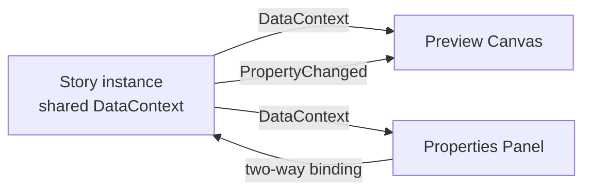

# Properties Panel

The properties panel occupies the right side of the Awen window and hosts interactive editors for the currently selected story.

## How It Works

When a story is selected:

1. Awen calls `CreateProperties()` on the story instance to get a `UserControl`
2. The story instance is assigned as the control's `DataContext`
3. The properties control is rendered in the right panel

Because both the preview and properties panels share the same story instance as their `DataContext`, editing a value in the properties panel updates the preview in real time through standard Avalonia data binding.



## Building Property Editors

Property editors are standard Avalonia controls bound to the story's public properties. Common patterns:

| Property Type | Control | Binding Example |
|--------------|---------|-----------------|
| `string` | `TextBox` | `Text="{Binding Label}"` |
| `bool` | `ToggleSwitch` | `IsChecked="{Binding IsEnabled}"` |
| `double` | `NumericUpDown` | `Value="{Binding FontSize}"` |
| `enum` | `ComboBox` | `SelectedItem="{Binding Severity}"` |
| Read-only | `TextBox` | `Text="{Binding Log, Mode=OneWay}" IsReadOnly="True"` |

For stories that have no editable properties, return a simple placeholder from `CreateProperties()`:

```xml
<TextBlock Text="No editable properties." Opacity="0.5" Margin="8" />
```

See [Story Structure](../sdk/story-structure) for complete examples of property editor XAML.

## Error Handling

If `CreateProperties()` throws an exception, the properties panel displays an error message instead of the editor controls.
